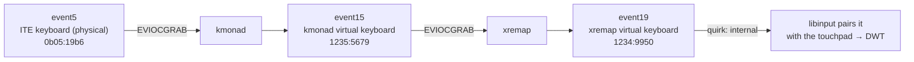

# Omarchy Trackpad Guard

Native palm rejection for Omarchy/Hyprland laptops whose keyboard is hidden behind a remap stack.

This plugin enables and manages Hyprland's built-in `disable_while_typing` (DWT) and `tap_to_click` for the internal touchpad, and installs the one piece libinput needs for DWT to work here: a quirks entry that classifies xremap's virtual keyboard as **internal**, so libinput pairs it with the internal touchpad. There is **no daemon, no evdev reading, no `EVIOCGRAB`, no udev rule, no ACL and no systemd unit** — libinput sees every event and classifies palms itself, which is exactly what makes the native path safe.

This build targets the **ASUS ROG Zephyrus G14 2024 (GA403)** running Omarchy with an active **kmonad → xremap** remap stack. It dynamically discovers the input event node and the Hyprland touchpad name, so it does not hard-code an event number, a username, or a device name.

It ships a bar widget for the Omarchy shell: a trackpad icon that opens a control panel with an on/off switch for DWT and a tap-to-click switch.

## Why the quirk is needed

On this machine the physical keyboard (`ITE Tech. Inc. ITE Device(8910)`, `0b05:19b6`) cannot be observed from user space: kmonad grabs it, and xremap grabs kmonad's output. The only keyboard node any userspace process may read is xremap's uinput keyboard:



libinput's DWT suppresses the touchpad only while typing on a keyboard it considers **internal** (paired with the internal touchpad). A uinput device is not internal by default, so typing through xremap never triggered DWT. The quirk (`AttrKeyboardIntegration=internal`, matched by name + vendor + product + bus) fixes the classification; from then on the native mechanism does everything: it is event-transparent, so contacts are always seen and palm-classified by libinput itself, and there is nothing to release at the wrong moment.

The `1234:9950` IDs are **not** an xremap constant — they are this machine's convention, set by `xremap.service` via `--vendor 0x1234 --product 0x9950 --output-device-name "xremap virtual keyboard"`. Port the flags, port the plugin.

Consequences of the native design:

- **Modifier shortcuts do not trigger DWT.** libinput only counts unmodified typing. `Ctrl+n/p/a/e` remaps (and any shortcut) leave the touchpad live, which is what you want — no special-casing needed.
- **External keyboards are not paired.** Typing on an external keyboard does not suppress the internal touchpad (standard libinput behavior).
- **The DWT timeout is not configurable.** libinput 1.31 has a DWT timeout API, but Hyprland 0.56 exposes no option for it (verified in `ConfigValues.cpp`). The panel has no slider because there is nothing to slide.

## Why not the previous designs

This repo tried two userspace approaches before settling on native DWT:

- **Per-burst `hl.device` toggles** — each toggle re-initializes the I2C HID device; under real use this produced intermittent ghost contacts on the untouched touchpad and stuck touch state in Hyprland (every gesture needed one extra finger until `hyprctl reload`) — the "dead trackpad" incident of 2026-09-04.
- **Exclusive evdev grab daemon** — an `evtest --grab` held while typing avoided the re-init cost, and releases were deferred until the pad was clean to avoid handing libinput a mid-flight contact (the 2026-09-05 ghost-finger class of bug). It worked, but it cost a daemon, a udev rule, two ACLs, a systemd unit, a watchdog and an orphan-reaper to keep safe — machinery whose only purpose was to approximate what libinput already does natively once the keyboard is classified correctly.

Native DWT removes the whole problem: no grab to release at the wrong moment, no device to re-initialize, nothing running between you and the kernel.

## Install

```bash
cd omarchy-trackpad-guard
./install.sh
```

Do not run the installer with `sudo`. It asks for sudo only for specific privileged operations: writing the quirks file under `/etc/libinput` and, when migrating from a legacy installation, removing the old udev rule and node ACLs and re-triggering the affected devices. The installer:

1. Removes any legacy installation of this plugin: stops and deletes the old systemd unit and timeout drop-in, kills a running guard and any validated orphan grabber, removes the old ACLs (preserving foreign entries such as voxtype's), deletes the old udev rule and re-triggers the affected nodes so coexisting rules re-apply their own ACLs.
2. Installs the helper at `~/.local/bin/omarchy-trackpad-guard`.
3. Manages the quirks section in `/etc/libinput/local-overrides.quirks` between sentinel markers. If an equivalent section already exists (as on this machine), it is **left untouched and unmanaged**. If a section matches the device but lacks the pairing attribute, the installer refuses with a conflict report. A newly created quirks file applies at the next login.
4. Deploys the bar widget to `~/.config/omarchy/plugins/ceblan.trackpad-guard` and enables it.
5. Runs the helper's `doctor` and prints a summary.

Running `./install.sh` again is safe and idempotent. No packages are installed, no services are created, sudoers is never touched.

## The bar panel

Click the trackpad icon in the Omarchy bar to open the panel:


- **Trackpad Guard switch** — toggles `disable_while_typing`.
- **Tap to click switch** — toggles `tap_to_click`.

Both switches track the **effective** Hyprland value. Writes go through the helper, which edits `~/.config/hypr/input.lua` structurally (a real Lua tokenizer/parser, not regexes), verifies the result and reloads Hyprland once per change. The panel watches `input.lua` and refreshes on external edits. When the file and the runtime disagree, captions say so (`EN ARCHIVO: … · PENDIENTE DE RELOAD`); a duplicated key is reported as an error to fix by hand. If the internal-keyboard quirk is missing, an advisory warns that DWT may not act.

The icon dims when DWT is off.

## The helper CLI

```bash
omarchy-trackpad-guard get [--json]     # file vs effective state for dwt and tap
omarchy-trackpad-guard set dwt on|off   # edit input.lua + verify + reload
omarchy-trackpad-guard set tap on|off
omarchy-trackpad-guard doctor           # quirk, xremap node, configerrors, state
```

Exit codes: `0` ok · `2` usage · `3` Hyprland unreachable · `4` `input.lua` missing/unreadable/broken · `5` unsupported grammar or ambiguous location · `6` concurrent modification or lock timeout · `7` reload/verify failed (the file was rolled back).

Safety properties of `set`: the target file is syntax-checked first; edits are byte-range replacements that preserve comments and formatting; a timestamped backup is written before every change (newest 5 kept as `input.lua.bak.trackpad-guard.*`); a single `hyprctl reload` applies the change under a lock; the effective value is polled afterwards and new `configerrors` lines mentioning `input.lua` trigger an automatic rollback. A key found outside the canonical `hl.config({ input = { touchpad = … } })` path, duplicated, or bound to a non-literal value fails closed (exit 5) instead of guessing.

## Uninstall

```bash
./uninstall.sh
```

Removes the bar plugin and the helper, runs the same legacy cleanup as the installer, and strips the managed quirks section between the sentinels. If the installer created the quirks file and nothing else remains in it, the file is deleted; if you added your own content (including comments), the file is kept. An external quirk the installer did not create is never touched. `evtest`/`acl` are left installed (other software may use them), and your `input.lua` values stay as they are. A quirk change applies at the next login.

## Dead trackpad recovery

Native DWT never disables the device, so the pre-native failure modes should be impossible. If the touchpad ever shows ghost contacts, needs an extra finger for gestures, or appears dead (e.g. after experimenting with other tooling), recover manually with a one-shot re-enable plus a reload:

```bash
omarchy-hw-touchpad    # prints the Hyprland device name, e.g. asuf1208:00-2808:0218-touchpad
hyprctl eval 'hl.device({ name = "asuf1208:00-2808:0218-touchpad", enabled = true })'
hyprctl reload         # re-initializes input devices, clearing stuck touch state
```

Run this by hand only. None of the scripts in this repo call `hl.device` — `make check` enforces it — because per-burst device toggles are what caused the 2026-09-04 incident.

## Troubleshooting

State and health:

```bash
omarchy-trackpad-guard get --json
omarchy-trackpad-guard doctor
hyprctl getoption input:touchpad:disable_while_typing
hyprctl configerrors
```

Check the quirk landed and the keyboard is classified internal:

```bash
cat /etc/libinput/local-overrides.quirks
libinput quirks list /dev/input/event19 2>/dev/null   # adapt to the current xremap node
```

Remember a newly created quirks file only applies at the next login. If `doctor` reports the quirk missing on a fresh install, log out and back in before suspecting anything else.

To find the current xremap node:

```bash
for event in /sys/class/input/event*; do
  input="$(readlink -f "$event/device")"
  [[ -r "$input/name" ]] && [[ "$(<"$input/name")" == "xremap virtual keyboard" ]] && echo "${event##*/}"
done
```

If `set` exits 6, something else modified `input.lua` while the helper worked — re-run the command; the external version was left untouched. If it exits 5, read the diagnostic: the key is duplicated, lives outside the canonical `hl.config` path, or uses a non-literal value, all of which need a manual edit. Backups (`input.lua.bak.trackpad-guard.*`, newest 5) sit next to `input.lua` if you ever need to compare.

If the lock appears stuck, find the holder:

```bash
fuser "${XDG_RUNTIME_DIR:-/tmp}/omarchy-trackpad-guard-${UID}.lock"
```

## Tests and checks

```bash
make check   # bash -n, constants↔template sync, no hl.device calls, plugin manifest, qmllint
make test    # helper matrix (27 scenarios) + install/uninstall sandbox (11 cases)
```

The install/uninstall tests run in a total sandbox (`OTG_ROOT`/`OTG_SYSFS_ROOT` overrides plus stub binaries) and never touch the host's `/etc`, `/sys` or systemd.

## Compatibility

- ASUS ROG Zephyrus G14 2024 (GA403) with Omarchy, Hyprland ≥0.56 (Lua config), and an active kmonad → xremap stack.
- Bash 5, `lua` + `luac`, `hyprctl`, Omarchy hardware helpers (`omarchy-hw-touchpad`) and the Omarchy shell (for the bar widget).
- The quirks template is rendered from the same four constants the scripts use (`KEYBOARD_NAME`/`VENDOR`/`PRODUCT`/`BUSTYPE`); `make check` enforces they stay identical across `bin/omarchy-trackpad-guard`, `install.sh`, `uninstall.sh` and `quirks/10-xremap-internal-keyboard.quirks.in`.

**xremap without kmonad** (xremap grabs the physical ITE keyboard directly): nothing changes as long as the same `--vendor`/`--product`/`--output-device-name` flags are kept — the node still lives under `/sys/devices/virtual` and matches the same constants.

**kmonad alone** (no xremap): the source becomes the `kmonad virtual keyboard` (`1235:5679`, bustype `0003`, also under `/sys/devices/virtual`). This is a constants-only change: the four constants in `bin/omarchy-trackpad-guard`, `install.sh` and `uninstall.sh`, which the quirks template renders from. `make check` keeps validating coherence.

**Without remappers** (no kmonad/xremap): the constants become `ITE Tech. Inc. ITE Device(8910)` / `0b05` / `19b6` / `0003`, and the sysfs check in the three scripts must be inverted (the node must **not** live under `/sys/devices/virtual`). Reinstall with `./install.sh` afterwards.

## License

MIT
