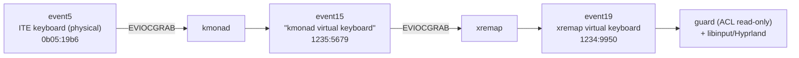
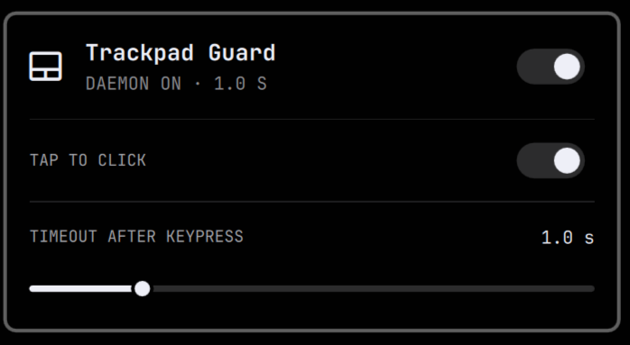

# Omarchy Trackpad Guard

An Omarchy/Hyprland palm-rejection daemon for laptops whose keyboard is hidden behind a remap stack.

While normal text keys are being pressed, the guard freezes the trackpad with an exclusive evdev grab. It releases the grab after one second of keyboard inactivity, so tap-to-click and physical clicking continue to work normally between typing bursts. Modifier shortcuts and navigation keys release the grab immediately.

This build targets the **ASUS ROG Zephyrus G14 2024 (GA403)** running Omarchy with an active **kmonad → xremap** remap stack. It dynamically discovers the input event node and the Hyprland touchpad name, so it does not hard-code an event number, a username, or a device name.

It ships a bar widget for the Omarchy shell: a trackpad icon that opens a control panel with an on/off switch for the daemon, a tap-to-click switch, and a slider for the idle timeout (0.5–3 s).

## Why it reads xremap's virtual keyboard

On this machine the physical keyboard (`ITE Tech. Inc. ITE Device(8910)`, `0b05:19b6`) cannot be observed from user space: kmonad grabs it, and xremap grabs kmonad's output. The only keyboard node any userspace process may read is xremap's uinput keyboard:



evdev is multi-reader: the guard watches the xremap node without interfering with Hyprland. The udev rule grants read access to that one keyboard node only (a second match in the same file covers the touchpad — see *How it works*). Unlike keyd's reserved `0fac:0ade` namespace, the `1234:9950` IDs are **not** an xremap constant — they are this machine's convention, set by `xremap.service` via `--vendor 0x1234 --product 0x9950 --output-device-name "xremap virtual keyboard"`. Port the flags, port the plugin.

Verified on this stack (2026-09-04, captured from `event19` with physical key presses):

- Physical Ctrl emits `KEY_LEFTCTRL` — the modifier exception works.
- Caps tapped emits `KEY_ESC`; Caps held while pressing another key emits `KEY_LEFTCTRL` (this machine's kmonad config, `tap-next esc lctl`), so e.g. Caps+A flows on as `Ctrl+a`. Both outcomes are treated as navigation/modifier keys by the guard.
- xremap remaps arrive as their target keys: `Ctrl+n` → `KEY_DOWN`, `Ctrl+p` → `KEY_UP`, `Ctrl+a` → `KEY_HOME`, `Ctrl+e` → `KEY_END` (with the modifier suppressed for the remapped key and restored after), so navigation remaps release the grab immediately.
- A held key emits a stream of `value 2` autorepeat events, so holding a text key keeps the trackpad grabbed continuously. Verified configuration: kmonad ≥0.4.4 (this machine runs 0.4.5), whose uinput node advertises `EV_REP`; xremap forwards the repeat events.

If the stack is removed (no kmonad/xremap), this plugin is **not** a constants-only change — see *Compatibility*.

## Install

```bash
cd omarchy-trackpad-guard
./install.sh
```

Do not run the installer with `sudo`. It asks for sudo only when installing the narrowly scoped udev rule. The installer:

1. Installs `evtest` and `acl` through `omarchy pkg add` if needed.
2. Installs the guard at `~/.local/bin/omarchy-trackpad-guard`.
3. Adds a device-specific udev rule granting read access to exactly two nodes — xremap's virtual keyboard (the guard's event source) and the touchpad (grabbed while typing) — removing legacy keyd-era/xremap-only rules if present, and verifies both ACLs actually landed before continuing.
4. Installs and starts the **systemd user unit** `omarchy-trackpad-guard.service` (`Restart=on-failure`, tied to `graphical-session.target`).
5. Deploys the bar widget to `~/.config/omarchy/plugins/ceblan.trackpad-guard` and enables it.

`xremap` is a practical requirement: without it there is no readable keyboard node, and the installer fails when discovery finds nothing. An inactive `xremap.service` only triggers a warning — the node itself is the source of truth.

Running `./install.sh` again safely updates the installation. A previous guard instance — including pre-systemd or manually launched ones — is terminated first (validated pidfile + escalation), so reinstalls never end with a silently stopped guard.

## The bar panel

Click the trackpad icon in the Omarchy bar to open the panel:



- **Daemon switch** — starts/stops `omarchy-trackpad-guard.service` (`systemctl --user`).
- **Tap to click switch** — flips `tap_to_click` in `~/.config/hypr/input.lua` and reloads Hyprland, so the change is immediate and persistent. (The Lua config parser refuses `hyprctl keyword`; editing the file + `hyprctl reload` is the supported path.)
- **Timeout slider (0.5–3 s)** — writes the `TRACKPAD_GUARD_TIMEOUT` drop-in (`~/.config/systemd/user/omarchy-trackpad-guard.service.d/override.conf`) and restarts the unit **only if it was active**, so a stopped daemon stays stopped.

## Adjust the delay

The default idle delay is one second. Use the panel slider, or a systemd drop-in:

```bash
systemctl --user edit omarchy-trackpad-guard
```

```ini
[Service]
Environment=TRACKPAD_GUARD_TIMEOUT=1.5
```

Then:

```bash
systemctl --user restart omarchy-trackpad-guard
```

## Uninstall

```bash
./uninstall.sh
```

This stops and disables the unit, removes the unit file and any timeout drop-in, removes the bar plugin, deletes the udev rule and both device ACLs (keyboard and touchpad), removes the guard binary and runtime files, and re-enables the trackpad. It leaves `evtest` and `acl` installed because other software may use them. After removing the ACL it re-triggers udev on the keyboard node, so any coexisting rule that matches it (e.g. voxtype's ACL rule) immediately re-applies its own ACL — the node ends as it was before this plugin was installed.

## How it works

Hyprland's built-in `disable_while_typing` may release the trackpad sooner than is comfortable between words. This guard reads key events from xremap's virtual keyboard and, while text keys are being pressed, holds an **exclusive evdev grab** (`EVIOCGRAB`, via a coprocessed `evtest --grab`) on the touchpad node (`omarchy-hw-touchpad` → sysfs name → `/dev/input/eventNN`, re-resolved before every grab). While the grab is held, the kernel delivers touch events only to the guard's fd, so libinput/Hyprland see nothing and the pointer stays frozen. Releasing is just closing the fd.

**Why a grab instead of `hl.device(enabled=…)`:** an earlier version of this plugin toggled the Hyprland device per typing burst. Each toggle re-initializes the I2C HID device; under real use this produced intermittent ghost contacts on the untouched touchpad and stuck touch state in Hyprland (every gesture needed one extra finger until `hyprctl reload`) — the "dead trackpad" incident of 2026-09-04. An fd-bound grab costs nothing to acquire or release, never re-initializes the device, and disappears automatically when the fd closes. A watchdog kills the grabber if the guard is `SIGKILL`-ed outside systemd, and systemd's default `KillMode=control-group` reaps it on unit stop/restart, so a dead guard can never leave the touchpad frozen.

The trackpad is grabbed only for ordinary text-key presses. The grab is released:

- after the configured idle timeout;
- immediately for modifier keys and navigation keys (including remaps that emit navigation keys, e.g. `Ctrl+a` → Home);
- whenever the guard exits, including `SIGINT`, `SIGTERM`, logout, or a keyboard event-stream failure (fd close releases the grab); and
- a one-shot `hl.device(enabled=true)` runs at every start and exit, purely to recover from state left by pre-grab versions — never per keystroke.

Every grab/release is logged to the journal (`journalctl --user -u omarchy-trackpad-guard`).

**Native `disable_while_typing`:** the guard supersedes it (configurable timeout plus modifier/navigation exceptions), so turning it off in `~/.config/hypr/input.lua` loses nothing. It is also a reasonable *diagnostic* step if the cursor ever seems stuck with this stack: one unproven hypothesis is that libinput's DWT can remain in the "typing" state while a modifier is held virtually by a kmonad/xremap layer. This has **not** been confirmed with an isolation test; treat disabling DWT as an experiment, not a proven fix.

The implementation was informed by the approach discussed in [omacom/omarchy discussion #1273](https://github.com/omacom/omarchy/discussions/1273), but runs as the desktop user and does not grant passwordless sudo access to a root control script.

## Security note

Linux normally restricts raw keyboard input. The installer adds ACLs that let the installing desktop user read exactly two nodes: xremap's virtual keyboard (the event source) and the touchpad (the grab target) — nothing physical beyond the touchpad, nothing else. Each udev match is exact (keyboard: `name` + `id/vendor` + `id/product` + `id/bustype`; touchpad: `ATTRS{name}` + `ID_INPUT_TOUCHPAD`) with no wildcards, the guard additionally requires the keyboard node to live under `/sys/devices/virtual/`, and the touchpad rule disambiguates the twin "Mouse" interface of the same I2C HID device. `make check` enforces that the keyboard match constants stay identical across the guard, the installer, the uninstaller and the udev rule template.

The match IDs are a local convention of this machine's `xremap.service` (its `--vendor`/`--product` flags), not a reserved xremap namespace — the exact match still pins the ACL to one synthetic node, and the `/sys/devices/virtual` requirement rejects any physical device spoofing the same IDs.

Another udev rule may legitimately match the same node (on this machine, voxtype's push-to-talk ACL rule does, granting the same user the same read bit). The two rules coexist harmlessly: udev runs both, the ACL is idempotent, and the uninstaller re-triggers udev after removing its own rule so the surviving rule restores its ACL at once.

Any process already running as that user can therefore read raw events from this keyboard (and the touchpad). That is the unavoidable tradeoff for implementing this workaround in user space. The rule does not make the devices world-readable and does not run the guard as root. `sudo` is used only interactively during install/uninstall; sudoers is never touched.

## Troubleshooting

Check that the guard is running and watch its decisions:

```bash
systemctl --user status omarchy-trackpad-guard
journalctl --user -u omarchy-trackpad-guard -f
```

Check the ACLs and confirm the expected nodes have one (the keyboard node — event19 today — plus the touchpad; note voxtype's coexisting rule also grants one on the keyboard node):

```bash
getfacl /dev/input/event19            # adapt to the current xremap node
getfacl -ps /dev/input/event* | grep -B9 '^user:.*:r--' | grep '^# file'
```

To find the current xremap node:

```bash
for event in /sys/class/input/event*; do
  input="$(readlink -f "$event/device")"
  [[ -r "$input/name" ]] && [[ "$(<"$input/name")" == "xremap virtual keyboard" ]] && echo "${event##*/}"
done
```

Prove the guard (not Hyprland's native `disable_while_typing`) is what freezes your trackpad: set `TRACKPAD_GUARD_TIMEOUT=3` via the panel slider or a drop-in, restart the unit, type, and measure — a ~3 s release is the guard; near-instant release is Hyprland.

If the touchpad ever shows ghost contacts or gestures need an extra finger (the signature of the pre-grab toggle design; should be impossible now), recover with:

```bash
systemctl --user stop omarchy-trackpad-guard   # releases any grab and re-enables the device
hyprctl reload                                 # re-initializes input devices, clearing stuck touch state
```

If the cursor seems lost: move the trackpad (Hyprland hides the cursor while typing; only pointer motion brings it back). Then check the journal — the guard logs every grab/release. To isolate the guard completely during diagnosis:

```bash
systemctl --user stop omarchy-trackpad-guard   # its cleanup re-enables the trackpad
omarchy-toggle-touchpad on                     # belt and braces; resolves the device itself
```

If the installer reports a held lock, find the holder and kill it:

```bash
fuser "${XDG_RUNTIME_DIR:-/tmp}/omarchy-trackpad-guard-${UID}.lock"
```

If the journal warns that the touchpad node is missing or unreadable, the grab is skipped and the pointer keeps working (fail safe) — check the touchpad ACL and re-run `./install.sh` to re-render the rule if the touchpad changed.

If `xremap` (or `kmonad`) is stopped, the guard exits and the trackpad simply stays enabled — it fails safe. Start/enable `xremap.service` and the unit recovers on its own.

## Compatibility

- ASUS ROG Zephyrus G14 2024 (GA403) with Omarchy, Hyprland (Lua config), and an active kmonad → xremap stack.
- Other laptops work too: the touchpad ACL rule is rendered at install time from the detected touchpad's sysfs name, and the keyboard match is portable wherever `xremap.service` uses the same `--vendor 0x1234 --product 0x9950 --output-device-name "xremap virtual keyboard"` flags — the match IDs are xremap's flags, not the laptop's.
- Bash 5, `evtest`, `acl`, `udev`, `systemd --user`, Omarchy hardware helpers and the Omarchy shell (for the bar widget).

**xremap without kmonad** (xremap grabs the physical ITE keyboard directly): as long as the same `--vendor`/`--product`/`--output-device-name` flags are kept, nothing changes — the node still lives under `/sys/devices/virtual` and matches the same constants.

**kmonad alone** (no xremap): the source becomes the `kmonad virtual keyboard` (`1235:5679`, bustype `0003`, also under `/sys/devices/virtual`). This is a constants-only change: the four constants in `bin/omarchy-trackpad-guard`, `install.sh` and `uninstall.sh`, plus the `ATTRS{...}` literals in `rules/99-xremap-virtual-keyboard-trackpad-guard.rules.in` (optionally rename the rule file and update `RULE_TEMPLATE`/`RULE_PATH`). `make check` keeps validating coherence.

**Without remappers** (no kmonad/xremap) the event source changes and this is a closed list of required edits, not just the constants:

1. The four constants in `bin/omarchy-trackpad-guard`, `install.sh` and `uninstall.sh` → `ITE Tech. Inc. ITE Device(8910)` / `0b05` / `19b6` / `0003`.
2. The `ATTRS{...}` literals in `rules/99-xremap-virtual-keyboard-trackpad-guard.rules.in` → the same ITE values (optionally rename the rule file and update `RULE_TEMPLATE`/`RULE_PATH`).
3. Invert the sysfs path check in all three scripts (from "must be under `/sys/devices/virtual`" to "must not").
4. Drop the xremap inactivity warnings in `install.sh` and in the guard.

`make check` still validates constants↔template coherence afterwards. Reinstall with `./install.sh`.

## License

MIT
